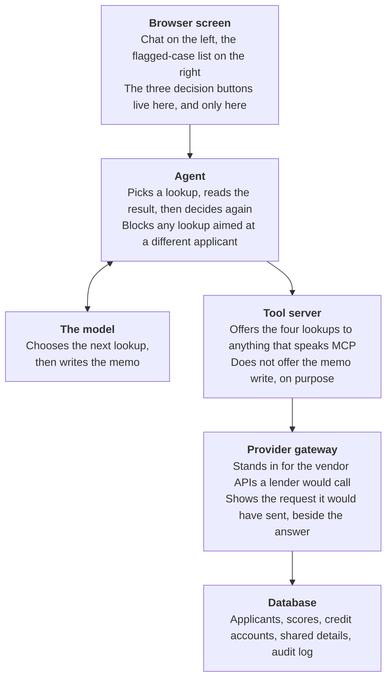
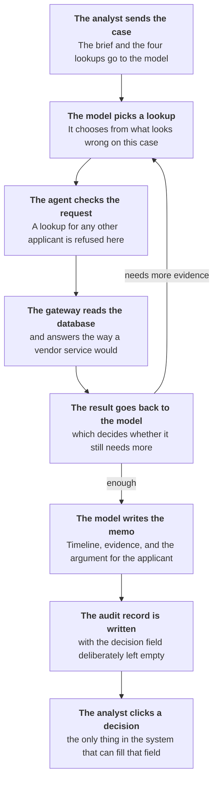

# Synthetic Identity Investigation Copilot

## What this is

A prototype assistant for a fraud analyst. A scoring service flags a credit
application as a possible fake identity. This tool then investigates that
application, works out how the identity was built up over time, and writes a
short case memo for a person to act on.

The rule it never breaks is that it decides nothing. There is no approve, reject
or escalate tool for it to call. Its only write to the database is the memo
itself, and the decision field on that record stays empty until a human sets it
from the screen.

Every applicant in it is invented. The data was built for the demo, not taken
from anywhere.

## What it actually does

Here is one case from start to finish. Applicant 1, Marcus Delane Hoyt, arrives
with an abuse score of 918 out of 999 and four reason codes.

1. **It checks the SSN two ways.** Social Security confirms the number, name and
   date of birth go together. But the number has no credit record at all before
   August 2016, and the claimed birth year is 1991. A real 1991 identity would
   leave roughly 25 years of records. A match with no history behind it is the
   thing worth looking at.
2. **It pulls the credit file.** Seven accounts. The first is a card where Hoyt
   was added as an authorized user in 2022, which hands over someone else's
   account age without any repayment history of his own. Then four accounts of
   his own in under three years, run up to 62% of their limits.
3. **It checks who else shares his details.** The same device and the same
   internet address appear on two other flagged applications, and all three were
   seen inside eleven days. His address appears on another one, but spread over
   550 days.
4. **It writes the memo.** A dated timeline of how the file was assembled, each
   finding tagged with the lookup that produced it, a counter-argument, and a
   confidence level of high.

The order is not fixed. It picks what to check from what looks wrong on the case
in front of it. A file flagged for a shared device gets a different
investigation from one flagged for sudden borrowing.

An analyst then reads the memo and picks one of three buttons: approve, reject,
or ask for more evidence. Only that click writes a decision.

## How it is put together

The layers exist so that each one can be swapped without touching the others.
The gateway is there because real fraud services are HTTP APIs that take a
person's details, so replacing it with a real vendor is a change inside one
function. The tool server is there so the same four lookups can be used by
something other than this app.

Two things are kept out of the shared tool server on purpose. The memo write
stays inside the agent, because anything that could reach the tool server would
otherwise be able to write to the audit log. And the check that a lookup is for
the right applicant also stays in the agent, because only the agent knows which
case is open.

## What happens on one request

The middle four steps are the loop. The model asks for a lookup, gets the
answer, and then decides whether it has enough or needs another. On a typical
case it goes round three or four times. Nothing in the code says which lookup
comes first.

Every one of those lookups is written into the audit record as it happens, with
what was asked and what came back. That record is what lets someone months later
see why the memo said what it said.

The last two steps are kept apart on purpose. Writing the memo and deciding the
case are different actions, performed by different parties, and the second one
cannot be reached from the first.

## Why this is useful

Fake identities are hard to catch because they are patient. Someone pairs a real
Social Security number with an invented name and date of birth, gets added to a
stranger's credit card to inherit its age, opens a small account, pays it on time
for two years, then borrows as much as possible and disappears. By the time the
borrowing happens the file looks ordinary, and the identity passes the Social
Security check because the number and the name have been reported together for
years.

An analyst working one of these today opens several systems, reads a credit file
line by line, hunts for links to other applications, and writes up notes. That
takes a while, and the queue does not get shorter.

This tool does the gathering and the first draft. The analyst reads a memo
instead of assembling one, and every lookup is already recorded with its result,
so the decision can be explained months later.

### The part that matters more than catching fraud

Most flagged applications are not fraud. If a tool only ever argues for fraud, it
quietly pushes analysts toward declining real people. Three of the cases in the
demo are built to show this:

| Applicant | Why it looks bad | What it actually is |
| --- | --- | --- |
| Nadia Osei-Kwame | No credit record before 2021, claimed birth year 1986 | Moved to the US as an adult. There is no earlier US credit history to find |
| Priya Raghunathan | Thin file, added to someone else's card as a teenager | A 22-year-old whose parent helped her start building credit |
| Oscar Bellweather | Score 766, borrowing stacked up fast | A real person with 20 years of clean history, now in trouble. A different problem, handled differently |

So two things are required of every memo. It has to argue the other side, signal
by signal, and say what evidence would settle each question. And it gives a
confidence level rather than a verdict, because "high confidence this identity
was built" is a finding an analyst can weigh, while "this is fraud, decline it"
is a decision that is not the tool's to make.

## What it costs, and how the cost came down

One investigation costs **$0.38**, measured on a real run. An estimate from
reading the code had put it at $0.11 to $0.22, so the real figure is above that
range. The estimate was wrong in a specific way, and it points at the fix.

### Where the money actually goes

The model is billed separately for what it reads and what it writes, and writing
is five times the price. Working back from the $0.38 at the current model's
rates:

| | Tokens | Cost | Share |
| --- | --- | --- | --- |
| Reading: prompt, tool definitions, and the conversation resent each turn | ~13,000 | ~$0.07 | 17% |
| Writing: the memo, plus the model's own reasoning before it answers | ~12,600 | ~$0.31 | 83% |

The second row is the surprise. The memo itself is only about 1,200 tokens of
that. The rest is the model thinking before it writes, which is billed the same
as visible output.

That changes the priority. The first cost review ranked caching first, because
more than half of what gets *read* is the same text resent every turn. That was
true, but reading is only a sixth of the bill, so caching can only ever save a
sixth of it.

### Changes already made

| Change | What it does |
| --- | --- |
| Cache the fixed part of the prompt | The instructions and tool definitions are identical on every call. They are now billed at a tenth of the rate after the first turn instead of full price every turn |
| Trim repeated text out of lookup results | One field explained the payment-history format once per account, so a seven-account file carried it seven times, and every later turn resent all seven. Moved into the cached instructions. Cut the largest lookup result by 18% |
| Cap web search at two uses | Search bills $10 per 1,000 searches on top of tokens. At four uses a case could spend more on search fees than on the whole model call |
| Record usage on every turn | Nothing was tracking what a run consumed, so there was no way to tell whether any of the above worked. The totals are now saved next to the memo |

### The two biggest levers, both still open

**Turn down how hard the model thinks.** The setting is at its default, which is
the second-highest of five. Because writing is 83% of the bill, this is the lever
with real room in it. Published measurements on work shaped like this one show
the middle setting costing about 70% of the default with no measurable loss in
accuracy, and the lowest setting about a third of the cost for one to three
points of accuracy.

**Move to a newer model.** The one in use costs $5 per million tokens read and
$25 written. Its successor is $4 and $20, and reads cached text at under half the
price. Cheaper and newer, which is unusual enough to check before assuming a
cheaper model means a worse one.

Neither is safe to just switch on. Both trade accuracy for money, which is why
there is a 50-case test set and a scoring harness in the project. The point of
those is to find out whether the cheaper setting is actually worse on this work,
instead of guessing.

### Development costs nothing

There is a demo mode that runs the whole thing with no model call at all. The
real loop runs, the real lookups hit the real database, the real audit record
gets written, and a built-in analyser assembles the memo from the actual lookup
results. All the interface and plumbing work was done in that mode for free, and
demo memos are labelled as canned in both the screen and the audit record so one
can never be mistaken for a real investigation.

## What is real and what is not

All 50 applicants are invented. No real person's data is in it, and it does not
connect to any live service.

The shapes of the data are copied from real formats, so the demo holds up in
front of someone who works in this field:

- **Credit accounts** use the real Metro 2 fields that lenders report to credit
  bureaus, including the single-character relationship code (1 for individual, 3
  for authorized user) and the 24-character payment history string, one
  character per month, most recent first.
- **The Social Security check** keeps two genuinely separate things apart. One is
  the match service, which only ever answers whether a number, name and date of
  birth go together. The other is the earliest date the number shows up in credit
  records, which is what fraud scoring actually leans on. An earlier version of
  this project ran them together as one field, which implied the match service
  reports something it does not.
- **The score** follows the published shape of a real synthetic-identity score: 0
  to 999, split into first-party and third-party components, with a risk tier and
  short reason codes.

The reason code names are invented. The structure follows a real product's, the
specific strings do not, and that is stated in the schema so nobody mistakes them
for the real vocabulary.

### Left out on purpose

No application-count velocity, no email age, no phone line type, no watchlist
screening, no address validation, and none of the remaining 33 Metro 2 fields.
Each would add a table and a lookup for one more signal, and the agent already
reasons over four kinds of evidence in visibly different orders depending on the
case.

### One limit worth knowing about the test set

The 50-case test set can reliably catch a big drop in quality. It cannot reliably
measure a small one. With 50 cases run three times, the margin of error is around
8 points, while the differences between model settings are often 2 to 8 points.
So a result from it should be read as a direction, not a decision, unless the
margin is checked first. There is a script in the project
(`python -m evals.power`) that works that margin out from the measured results
rather than assuming it.
